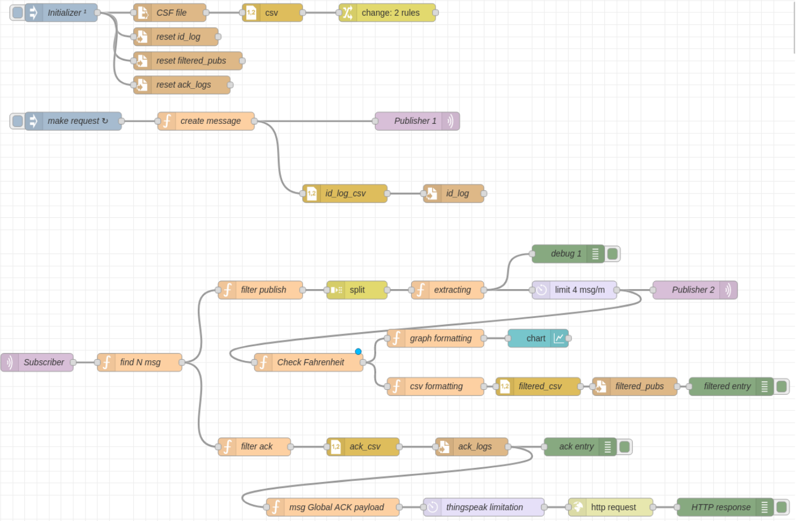

# nodeRed-IOT-2024
This is the project realized in the course "Internet of things" during the academic year 2023/2024.

## Project goal
The objective of the project is to analize a dataset of packets, extract some specific ones among them and publishing on a MQTT broker.

After that it is required to catch the published message with an MQTT subscriber and elaborate the data received, using Javascript and the JSON format.

In the end using thingspeak, a global counter (calculated filtering only some of the packets which passed all the other stages) is sent to a public thingspeak channel.

## Complete NodeRed flow

